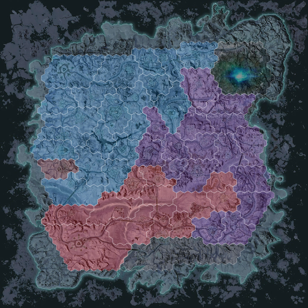
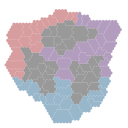
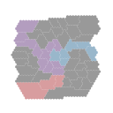
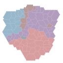
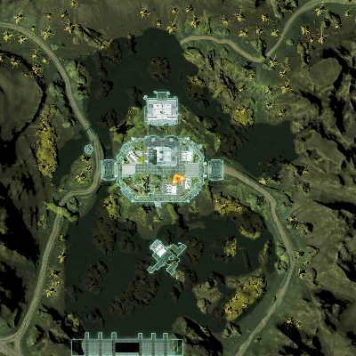
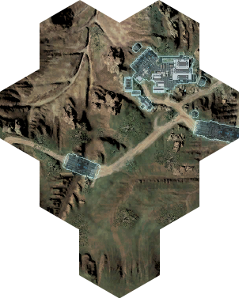

# About

`mapgen` is a command line tool to render planetside maps with territories colored by current faction control.
It was originally built for embedding map images into live-updating Discord server dashboards,
but it may be useful for other projects.

It is designed to be easy to integrate into other PlanetSide projects or re-host.
There are no external system dependencies and no additional required files;
data and images are bundled with a single stand-alone binary.

The project is written in 100% Go,
and may be compiled for any target operating system.

## Installation

```sh
git clone git@github.com:Travis-Britz/ps2.git
cd ps2
go build ./cmd/mapgen
./mapgen.exe -h
```

Alternatively, using [go install](https://go.dev/ref/mod#go-install):

```sh
go install github.com/Travis-Britz/ps2/cmd/mapgen
mapgen -h
```

## Usage

There are a few distinct ways to interact with `mapgen`.

Each mode of operation requires different sets of command line arguments.
The process will function differently depending on which mode it is running in,
and it only runs in one mode for the lifetime of its operation.

The arguments required for each mode are documented separately below.
However, to view the full command line options, run the following:

```sh
# This prints command usage to the terminal.
mapgen -h
```

### Command Line Interface

The first way to interact with `mapgen` is as a command line process that renders a map image.

The general syntax is as follows:

```
mapgen [options] [output]
```

When `[output]` is present it will generate a single file and send it to that output.
Server and zone are required in this mode.

The following command will retreive the Emerald Esamir territory ownership from Census using the "example" Service ID and render a PNG, saving it to "output.png":

```sh
mapgen -s example -world emerald -zone esamir output.png
```

The rendered image will look something like this:



The output can be sent to Stdout instead by using "-" as the output filename:

```sh
mapgen -s example -world emerald -zone esamir -
```

This may be more convenient for calling `mapgen` from within another process,
as there is no need for an intermediate file to be written to disk.

When `[output]` is omitted,
it will generate multiple files and send them to `-outputdir` (which defaults to current directory).

Some examples:

```sh

# This generates every map on every server, i.e:
# ./emerald/indar.png
# ./emerald/hossin.png
# ./emerald/esamir.png
# ./emerald/amerish.png
# ./emerald/oshur.png
# ./connery/indar.png
# ./connery/hossin.png
# ./connery/esamir.png
# ./connery/amerish.png
# ./connery/oshur.png
# ./genudine/indar.png
# ./genudine/hossin.png
# ./genudine/amerish.png
# ./genudine/oshur.png
# [...] etc.
mapgen -s example
```

```sh
# This generates all of Emerald's maps and places them in outputdir:
# maps/emerald/indar.png
# maps/emerald/hossin.png
# maps/emerald/esamir.png
# maps/emerald/amerish.png
# maps/emerald/oshur.png
mapgen -s example -world emerald -outputdir maps
```

```sh
# This generates only one map but still places it in the default outputdir:
# ./emerald/indar.png
mapgen -s example -world emerald -zone indar
```

This batch mode is the most efficient for generating live maps every 1-2 minutes on a cron job and then serving them as static files from any webserver.
If files are served this way,
be sure to configure your webserver with an appropriate cache response header:

```
Cache-Control: public, max-age=120
```

#### Output Format

Map state can be rendered in a number of different ways by using the `-format` option.
The default format is the 512x512 image with terrain,
as shown above.

The following command will render maps as 128x128 transparent PNGs by using `-format thumbnail`:

```sh

# This generates all of Emerald's maps as thumbnails and places them in outputdir:
# maps/thumbnail/emerald/indar.png
# maps/thumbnail/emerald/hossin.png
# maps/thumbnail/emerald/esamir.png
# maps/thumbnail/emerald/amerish.png
# maps/thumbnail/emerald/oshur.png
mapgen -s example -world emerald -outputdir maps/thumbnail -format thumbnail
```

The thumbnail renderer generates files that look something like this:





There is also a `json` renderer for maps,
but I will leave it as an exercise for the reader, both to see what it looks like as well as find something to use it for.

### Drawing /loc

The game has a `/loc` command that can be typed in chat to give a precise character location and heading. Here is an example of the output from this command in-game:

```text
x=3211.266 y=470.785 z=3136.692, Heading: 0.681   /loc 3211.266 470.785 3136.692
```

The result of this command can be plugged into mapgen with the following syntax:

```sh
mapgen -s <ServiceID> -zone <zone> -loc "<x> <y> <z> [heading]" <output>
```

The heading is optional.
When it is included,
a player arrow icon will be drawn pointing in the direction of heading.
For example:

```sh
mapgen -s example -zone esamir -loc "211.266 470.785 -2136.692 -2.101" loc.png
```

will generate an image that looks something like this:



### Drawing Regions

```sh
mapgen -s example -region 2419 regions/2419.png
```



### HTTP Interface

The second mode runs `mapgen` as a fully self-contained webserver.
This mode should be easy to proxy to for usage within a larger API,
as well as being easy to containerize.

This mode is activated when the `-serve` flag is present.

The following command will start `mapgen` as an HTTP server bound to the loopback interface on port 8080:

```sh
mapgen -s example -serve localhost:8080
```

This is ideal for sitting behind an Nginx proxy.

To make the server accessible from outside the machine it's running on, you may bind to all interfaces:

```sh
mapgen -s example -serve :8080
```

The allowed format for the bind address can be anything accepted by [net.Listen](https://pkg.go.dev/net#Listen).

The webserver responds to requests with a PNG image.
The routes match the format:

```
GET http://localhost:8080/{world}/{zone}.png
GET http://localhost:8080/regions/{region}.png
GET http://localhost:8080/facilities/{facility}.png

```

e.g.:

```
GET http://localhost:8080/emerald/indar.png
GET http://localhost:8080/genudine/indar.png
GET http://localhost:8080/regions/2419.png
GET http://localhost:8080/facilities/218.png
```

These images are pre-generated,
which means there is essentially zero overhead for each request.
Approximately 200MB of disk space is required for the file cache using 4096x4096 map images.

### JSON Data Files

The third way to use `mapgen` is to save static map lattice data files locally.
This mode is activated when the boolean `-data` flag is present.

The resulting data contains all of the information from Census needed for rendering a map.
The format is the json encoding of the `psmap.Map` structure.

This is useful for a number of reasons:

-   Saving historical region and lattice structure.
    Maps are updated over time,
    and it may be desired to render versioned maps.
-   Local caching for the `psmap` package.
-   Patching Census data. A local copy can be downloaded and patched with missing or incorrect entries filled and then used with the `psmap` package.

The following command will save a JSON file to "mapdata.json":

```sh
mapgen -s example -data -env ps4us mapdata.json
```

The `-env ps4us` argument is optional in this mode,
however keep in mind that PS4 is updated less frequently than PC,
and may have older maps and lattices.
The `-env` flag is not needed in other modes because the environment can be deduced from the world ID.

## Service ID

Sign up for a Census Service ID here: https://census.daybreakgames.com/#service-id

This documentation uses `-s example` everywhere to run the process using the "example" service ID.
This is a valid ID with very restricted rate limits.
It will work for casual use,
but you should register a service ID if you intend to run the progam automatically.

## TODO

Version 1.0

-   ✅ implement http route parsing
-   ✅ generate all maps for serving static files
-   ✅ rewrite http server to use the static data files
-   ⬜️ document the command's existence in the main `ps2` readme
-   ✅ add timeout and retry to census request
-   ✅ pass context through to map requests and exit on Ctrl+C
-   ✅ add a flag to configure the drawing function
-   ✅ add a discord thumbnail drawing function (128x128 and 300x300) with no terrain background
-   ✅ add a way to generate maps without the background for use in overlays
-   ⬜️ rename region command line flags
-   ⬜️ add a flag to trim hex regions
-   ✅ implement minimal caching for http server
-   ⬜️ implement `-datafile`
-   ⬜️ document `-datafile`
-   ✅ output map state as json
-   ⬜️ allow rendering from json to render historical maps
-   ⬜️ parse integers so that custom data can be supplied for maps that we don't have?
-   ✅ generate cropped region images
-   ✅ add a /loc renderer to zoom in on a location
